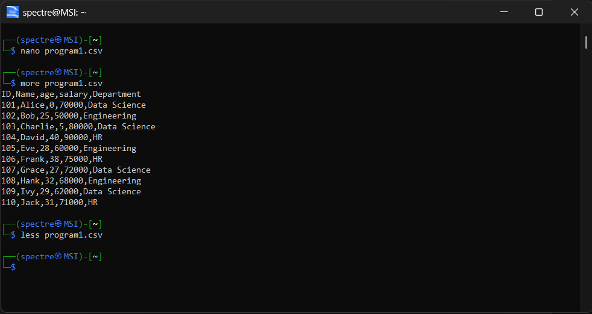
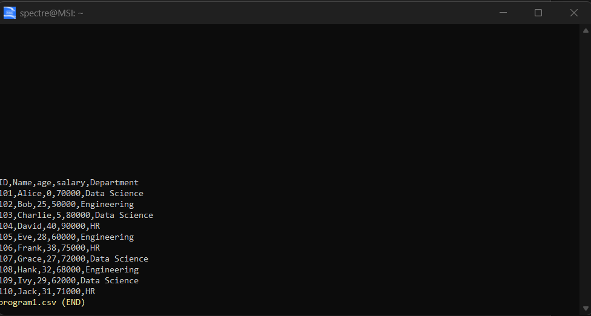
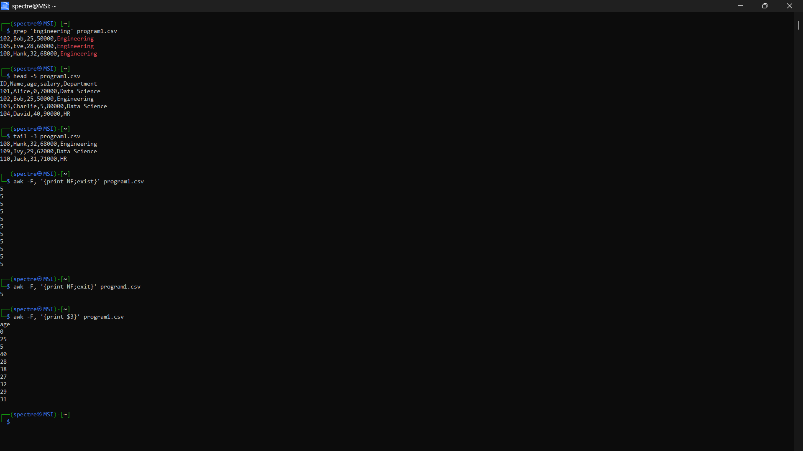

# Operating System Course - Day 01

> 📚 A comprehensive collection of daily practical lessons for Operating System course focusing on Windows batch scripting.

## 📋 Course Overview

This repository contains practical exercises and implementations for the Operating System course. Each lesson is organized with batch scripts and their corresponding outputs.

## 🗓️ Day 01 Content

### 🎯 Learning Materials

- `Day_01.bat` - Main batch script for day 1
- `Day01_displaydetails.bat` - Display system details script
- `OS.bat` - Operating system related commands
- Various standard directories for different criteria

### 📊 Implementation Structure

| Category | File | Description | Visual Output |
|----------|------|-------------|---------------|
| Main Script | `Day_01.bat` | Primary batch script implementation |  |
| System Info | `Day01_displaydetails.bat` | System details display script |  |
| OS Commands | `OS.bat` | Operating system command demonstrations |  |

### 📁 Directory Structure

- `criteria_1/` - First criteria implementations
- `standard_1/` - Standard one exercises
- `standard_2/` - Standard two exercises
- `standard_3/` - Standard three exercises
- `standard_4/` - Standard four exercises

### 🔍 Technical Notes

- All implementations are in Windows Batch Script
- Each script includes comprehensive command demonstrations
- Visual outputs are captured for reference
- Consistent script formatting and naming conventions

---

📖 **Learning Path** | 🛠️ **Practical Examples** | 📊 **Visual Outputs**

